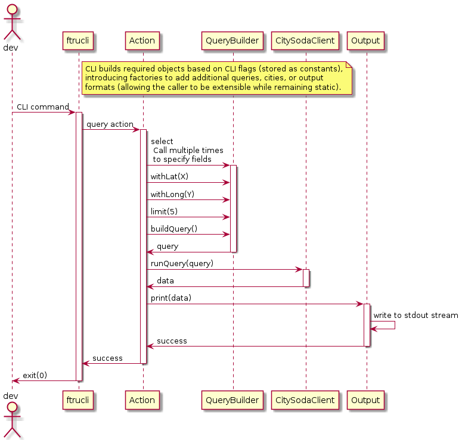

# ftrucli

[](https://travis-ci.com/SpaceKatt/ftrucli)

`ftrucli` is a Food Truck CLI used to find food trucks near a geospatial coordinate (especially in San Francisco).

- [ftrucli](#ftrucli)
  - [MVP Meta](#mvp-meta)
    - [Foundational Intent](#foundational-intent)
    - [MVP Design Intent](#mvp-design-intent)
    - [Out of Scope for MVP](#out-of-scope-for-mvp)
    - [Initial Design Description](#initial-design-description)
  - [CLI Instructions](#cli-instructions)
    - [Installation](#installation)
    - [Usage](#usage)
      - [Help Dump](#help-dump)
      - [Usage Examples](#usage-examples)
  - [Development](#development)
    - [Build Toolchain Setup](#build-toolchain-setup)
      - [Install `node14`, using `nvm`](#install-node14-using-nvm)
      - [Install `pnpm` and `heft`](#install-pnpm-and-heft)
    - [Install Dependencies](#install-dependencies)
    - [Build](#build)
    - [Test](#test)
    - [Linting](#linting)
  - [CI/CD](#cicd)
    - [Continuous Integration](#continuous-integration)
    - [Continuous Deployment](#continuous-deployment)
  - [Publishing](#publishing)
    - [Versioning](#versioning)
    - [`npm` Publishing](#npm-publishing)
    - [Release Branching](#release-branching)
  - [Decision Log](#decision-log)

## MVP Meta

This section describes the author's intent while building the minimum viable product (MVP) for `ftrucli`.

### Foundational Intent

Above and beyond all else, the intent of this project is to...

- Demonstrate author's values
- Showcase author's problem solving process
- Curate collaboration environment (provide ideal open-source dev experience)
- Cut a release ~3 hours after `init commit`

### MVP Design Intent

The following areas of focus drove the design of the `ftrucli` MVP...

- Implement bare minimum feature set (give at least five (5) food trucks, given a coordinate pair)
- Prioritize production rediness by focusing on...
  - Organization
  - Design
  - Testing
  - Deployment
  - Documentation
- Design for extensibility

### Out of Scope for MVP

Out of scope features for the MVP...

- `--open-now` - filter for open food trucks
- data caching - all queries will be against the SF SODA endpoint
- search by street address, using the [Bing Maps API](https://docs.microsoft.com/en-us/bingmaps/rest-services/locations/find-a-location-by-address)
- using an app token (and storing it in a `.env` file or Azure Key Vault)

### Initial Design Description

The CLI will follow the basic flow of the following diagram...

)

Author _may_ or may not have time to implement factories for extensibility. If they do, then the `Output` class will be the first refactoring candidate (to output results in either a prettified table or raw `json`).

## CLI Instructions

### Installation

Install the CLI globally from npm.

```bash
npm install --global ftrucli
```

### Usage

This section contains the CLI help messages and some examples.

#### Help Dump

General help dump...

```bash
$ ftrucli --help
usage: ftrucli [-h] [-v] <command> ...

Food Truck CLI used to find food trucks near a geospatial coordinate
(especially in San Francisco).

Positional arguments:
  <command>
    coord        Finds food trucks within a specified distance from a
                 coordinate pair.

Optional arguments:
  -h, --help     Show this help message and exit.
  -v, --verbose  Print out all the debug!

For detailed help about a specific command, use: ftrucli <command> -h
```

`coord` command help dump...

```bash
$ ftrucli coord --help
usage: ftrucli coord [-h] --long LONGITUDE --lat LATITUDE [-n LIMIT]
                     [-d DISTANCE]


Finds food trucks within a specified distance from a coordinate pair. Filters
exist for limiting the number of food trucks which are displayed.

Optional arguments:
  -h, --help            Show this help message and exit.
  --long LONGITUDE      A user's longitude.
  --lat LATITUDE        A user's latitude.
  -n LIMIT, --limit LIMIT
                        Limits the number of responses returned from a SODA
                        query. The default value is 6.
  -d DISTANCE, --distance DISTANCE
                        The distance (in meters) to search outwards from a
                        coordinate point. The default value is 5000.
```

#### Usage Examples

```bash
# Set long/lat, use default distance and limit
ftrucli coord --lat 37.80 --long -122.43
```

```bash
# Specify distance
ftrucli coord --lat 37.80 --long -122.43 --distance 7331
```

```bash
# Specify limit
ftrucli coord --lat 37.80 --long -122.43 --distance 7331 --limit 1
```

## Development

### Build Toolchain Setup

This section describes how to set up the project's build toolchain. `node14` (managed by `nvm`), `pnpm`, and `heft` are the critical tools which enable our build process.

#### Install `node14`, using `nvm`

```bash
# Install nvm
curl -o- https://raw.githubusercontent.com/nvm-sh/nvm/v0.37.2/install.sh | bash
source ~/.bashrc

# Install node14
nvm install 14
nvm use 14
```

#### Install `pnpm` and `heft`

```bash
npm install --global pnpm
pnpm install --global @rushstack/heft
```

> NOTE: Since this project uses `pnpm`, please use it to install new packages (instead of `npm`). This helps maintain the `pnpm-lock.yaml` file.

### Install Dependencies

Use `pnpm` to install all project dependencies.

```bash
pnpm i
```

### Build

This project uses [`heft`](https://rushstack.io/pages/heft/overview/) as a build coordinator.

```bash
heft build
```

### Test

This project uses [`heft`](https://rushstack.io/pages/heft/overview/) as a test orchestrator (`jest` under the covers).

```bash
heft test
```

### Linting

This project uses [eslint](https://eslint.org/) for linting. (TSLint is now deprecated.)

We recommend using [this eslint VS Code extension](https://marketplace.visualstudio.com/items?itemName=dbaeumer.vscode-eslint).

## CI/CD

This section details this project's CI and CD practices.

### Continuous Integration

Continuous integration is performed on [TravisCI](https://travis-ci.com/github/SpaceKatt/ftrucli), as defined by [`.travis.yml`](.travis.yml). Heft is installed, used to build the project, then used to test the project.

### Continuous Deployment

Continuous deployment is out of scope, but on the roadmap.

The plan is to [use GitHub actions](https://docs.github.com/en/actions/guides/publishing-nodejs-packages) to "watch" branches of the pattern `release/*`, create GitHub releases, and publish said releases to the [`ftrucli` package repository](https://www.npmjs.com/package/ftrucli).

## Publishing

`ftrucli` is [published on `npm`](https://www.npmjs.com/package/ftrucli). This section describes best practices surrounding publishing `ftrucli` to its `npm` repository.

### Versioning

[Semantic versioning](https://docs.npmjs.com/about-semantic-versioning) via [using `npm`](https://docs.npmjs.com/updating-your-published-package-version-number) is standard procedure.

```bash
npm version <major|minor|patch>
```

### `npm` Publishing

Use `npm` to publish the package at the current version.

```bash
npm publish
```

> Please create a release branch following each successful publish.

### Release Branching

[Release flow](https://docs.microsoft.com/en-us/azure/devops/learn/devops-at-microsoft/release-flow) dictates we create a `release/*` branch, off of `main`, after each release. This is done by checking out a new branch after `npm publish` to "snapshot" the release version using the `release/*` naming convention. The wildcard, `*`, represents a monotonically increasing sequence of non-negative integers that is incremented on each `publish`.

Hotfixes are implemented in a hotfix branch and then pulled into both the current release branch and `main`, via PR. Old releases are treated as discardable, thus not patched.

## Decision Log

| Decision                                                                   | Brief Description                                       |
| -------------------------------------------------------------------------- | ------------------------------------------------------- |
| [Rushstack used as project tool chain](./docs/adr/0001-heft-buildchain.md) | Rushstack provides us with build and CLI tools.         |
| [TravisCI used for CI](docs/adr/0002-travis-ci.md)                         | TravisCI is this project's continuous integration tool. |
